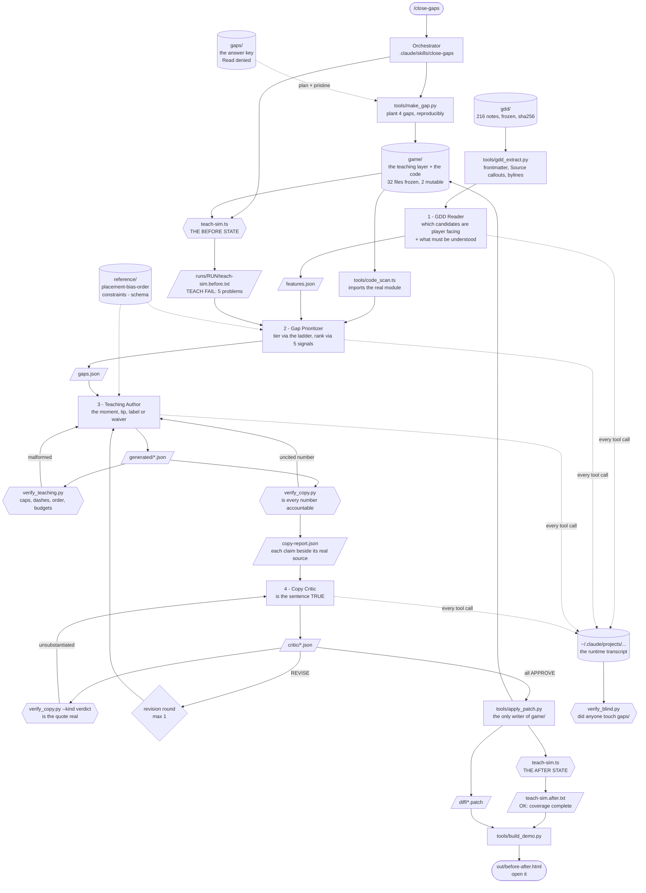

# Architecture

Why the data flows this way, and why each check lives where it does.

## Why the GDD is vendored and frozen

The design vault is a live Obsidian repo that changes weekly. A run measured
against a moving document proves nothing twice. `gdd/` is a byte copy with a
sha256 per note and a rollup, so "the agent read the GDD" is a checkable claim
rather than a description of intent.

Freezing it also makes the exclusions honest. `gdd_extract.py` drops 86 of 216
notes: house style law, process docs about the crew itself, the one superseded
note describing a deleted system, and everything with `status: unwritten`. Each
exclusion is a named rule with a stated reason, printed on every run. A corpus
narrowed silently is a corpus you can make say anything.

## Why the game slice is vendored verbatim, and mostly frozen

`teach-sim.ts` imports only from within `src/game/`, so copying those 27 files
means **the shipped game's own harness runs here, unmodified**. That is worth
more than any check this repo could write, because it is the check the game
already trusts.

The manifest marks 32 of 34 files frozen. Only `content/teaching.ts` and
`duel.tsx` are mutable, because those are the two the pipeline writes. That
split is the point: a green build is worthless if the way it went green was
editing `cascadeRam` to agree with the copy instead of editing the copy to
agree with `cascadeRam`. `selftest.py` fails if a frozen file moves.

## Why the gaps are planted, and why that is said out loud

The shipped game's teaching coverage is complete. `teach-sim` prints
`OK: 39 mechanics, 25 taught, 14 waived`. There was no red state to demonstrate,
so `make_gap.py` removes four, and the README says so in its first paragraph.

What keeps the demo honest is three things. The removal is a committed script
reading a committed plan, so the before state is derived on demand rather than
hand authored. The four gaps have four **different** correct answers, so a seat
cannot pass by writing four coachmarks. And the crew is not told what was
removed.

## Why the answer key is committed but unreadable

`gaps/removed.json` records the exact text taken out, which is what makes the
before and after a real diff rather than a claim. A reader needs it. The crew
must not have it.

So it is committed, `Read(gaps/**)` is denied in `.claude/settings.json`, and
`verify_blind.py` audits **the runtime's own transcript** of every tool call the
session made, subagents included. That covers shell reads too, because a
`cat gaps/removed.json` appears in the recorded command string.

The first version of this asked each seat to append what it opened to a ledger.
The first real run produced no ledger at all, which is the failure you would
predict from asking the subject to file its own paperwork. Auditing the
transcript removes both the forgetting and the forging.

## Why the ladder is a procedure and not a score

The obvious way to prioritize is a weighted score: assign points for severity,
reach and cost, sort, done. It would have been quicker to write and it would
have been fiction, because the weights would have been invented for this
assignment and tuned until the output looked sensible.

The placement bias order is the real decision procedure the game's tutorial
seat already uses. It is five questions asked in order with a stop condition,
and the answer is the rung you stop on. It has a property no score has: **it
prefers not building.** Tier 0 says make the interface carry it, and the
correct output is then a better label and a waiver, not a teaching artifact.

`gaps.json` requires a `ladderStop` naming which question stopped and why the
cheaper rungs cannot carry the mechanic. That field is the reasoning layer. If
it is empty the run has produced work without producing a decision, and the
orchestrator re-spawns the seat.

## Why tier 0 outranks a coachmark

A coachmark is read once and dismissed forever. A label is on screen every time
the player looks at the control. When both can carry a mechanic the label
carries it better, and it costs nothing from a teaching budget that is
genuinely finite: the harness caps two unconditional callouts and four total
per surface, and one surface in the shipped game is already at its cap.

The precedent is real. `patchCraft` used to have a coachmark. The bench's own
status line taught the rule more persistently, the moment was retired, and
coverage did not drop. Teaching got better by deleting a teaching artifact.

## Why the linter and the critic must not overlap

`verify_teaching.py` owns shape: caps, dashes, ALL CAPS, order collisions,
surface budgets, whether the mount anchor is a real line. Every one of those is
decidable by a script, and a script cannot be talked out of a verdict.

`verify_copy.py` owns accountability: is every number in the copy covered by a
claim, does every claimed symbol resolve to real code. Also decidable.

The critic gets what is left, which is the only part that needs reading: does
the symbol actually say what the copy says it says. Both scripts run and must
be clean **before** the critic sees anything, so a critic finding is never a
restatement of something mechanical.

## Why verify_copy stops short of judging

It would be easy to make `verify_copy.py` compare the number in the copy
against the number in the symbol and fail on mismatch. It would also be wrong
about half the time. `cascadeRam` returning 0 when `lit < 3` means three is the
first paying count; no arithmetic on the literal `3` tells you whether "three
or more" or "more than three" is the true sentence, and `Math.min` two lines
down can change the answer again.

So the tool guarantees something narrower and actually achievable: the copy
cannot state a number without naming a symbol, the symbol must exist, and the
symbol's real source is printed directly beneath the claim. The judgment stays
with the critic, and the critic cannot avoid seeing the evidence.

The `fixtures/copy/shipped-cascade.json` case pins exactly this. It is the real
shipped copy and it passes, on purpose, because it is mechanically accountable.
What the fixture asserts is that `if (lit < 3) return 0;` appears in the output
directly under `copy says: "four or more nodes"`.

## Why "one" is not checkable

An early version flagged every number word. In this copy register "one" is
almost always the indefinite article: one rotation, one node at a time, one
unturned junction. Three false positives buried the single real finding, so the
word is exempt and digits are not, which keeps "1 RAM" catchable.

A checker that flags everything proves nothing, and the exclusion is a stated
limit rather than a silent one. A wrong "one" is the critic's to catch.

## Why generation and application are separate steps

The seats emit JSON. `apply_patch.py` turns it into TypeScript and writes it.
Nothing else writes `game/`.

That ordering is what lets both verifiers run against a complete, checkable
description of the change **before** any file is touched. It also means a
malformed moment is a rejected JSON file rather than a broken module, and the
seats need no write access to the game at all.

Moments are inserted in `order` position rather than appended, because the
registry reads as a precedence list and appending would erode that over time.

## Why there is no typecheck step

`bun` parses the generated TypeScript when `teach-sim.ts` imports it, so a
malformed moment fails with a file and a line number before any check runs.
A separate `tsc` pass would need `@types/node` and `npm install`, which would
cost the repo its no network property to re-prove something the harness already
proves.

## Failure paths

- **`bun` missing.** No harness, no scan, no run. The before and after outputs
  are committed under `runs/`, so the evidence survives, and the page still
  opens. The README says which claims degrade to committed output.
- **A seat returns nothing usable.** The orchestrator re-spawns it once with the
  problem quoted, then stops and reports. It never writes the artifact itself.
- **The prioritizer returns four coachmarks.** The orchestrator names it in the
  re-spawn. Pattern matching is the specific failure this crew is exposed to.
- **A verdict cannot substantiate its quote.** It is downgraded, not argued.
  That is a correct outcome, not an error.
- **`apply_patch.py` cannot place a mount.** It restores both mutable files from
  the backup it took and exits non-zero, rather than leaving half a moment
  behind.
- **The harness is still red after applying.** Either the drafts violated a real
  constraint, which is the author's problem, or the patch landed wrong, which is
  the tool's. Neither is fixed by hand editing `game/`.
- **`verify_blind.py` fails.** The run is reported as failed. Re-running quietly
  would make the ledger meaningless.
