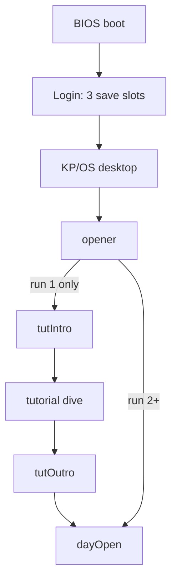
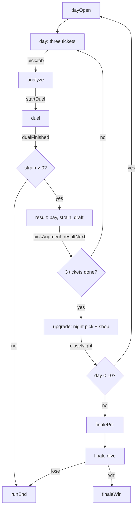

# Game flowchart

> [!info] Source
> `save.ts:RunScreen`, `run-reducer.ts` transitions.

## Boot to run

## The day

## Screens

`opener` · `tutIntro` · `tutorial` · `tutOutro` · `dayOpen` · `day` · `analyze` · `duel` · `result` · `upgrade` · `finalePre` · `runEnd` · `finaleWin`

Plus `build`, which is **vestigial**: nothing routes to it any more. It is the cut mandatory build stop. See [[design-change-log]].

## Two things the diagram does not show

**Refresh is a safe abort.** Transient screens are never resumed into. Reloading mid-dive puts you back at the day, not into a corrupted duel. See [[save-and-load]].

**The night is two-step.** `chooseUpgrade` sets the pick without ending the night; `closeNight` commits and refuses without a pick. So the shop stays open while you reconsider. See [[the-night-shop]].

## See also

- [[core-loop]] · [[kp-os]]
