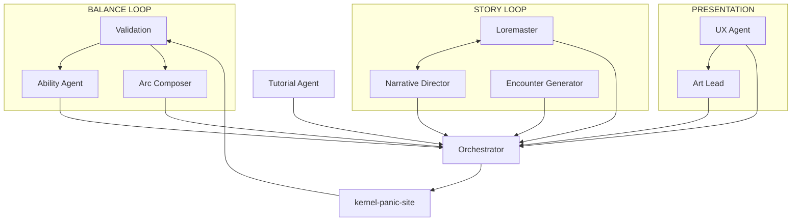

# The dev crew

Ten seats. One integrates; nine propose.

> [!danger] REVISED IN PROTOTYPE
> The pipeline stopped being a proposal. **Every loop in it was executed by hand at least once during the build before it was written down as a system.** What follows describes what those loops actually caught, not what they were expected to catch.

## The org

## Four principles

**Agents run at dev time, never at runtime.** The shipped game contains no model calls. Everything the crew produces is baked into content modules before the build.

**Structured artifacts only. Prose handoffs are banned.** Agents write JSON to fixed paths. An agent that "explains" its proposal in a message has produced nothing.

**The Orchestrator is the sole code owner.** Only it writes to `kernel-panic-site/`. Agents propose; integration is by hand; `bun run typecheck` is the schema enforcer.

**One agent, one file, one harness.** Each seat owns a single output path and, where applicable, a single measurement that proves its work.

## Where sound lives

With the [[ux-agent]], not a separate audio seat. Sound is feel, and feel is one job: the agent deciding that a press state floods inverse video is the one who should decide what it sounds like. See [[music-and-sound]].

## Model routing follows constraint, not prestige

Haiku carries the high-call-count seats ([[validation]] at 240 calls, [[art-lead]] at 120) to keep load off the Sonnet cap. Fable 5 is reserved for the [[orchestrator]]. See [[token-budget]].

## See also

- [[the-pipeline]] · [[the-plays]]
